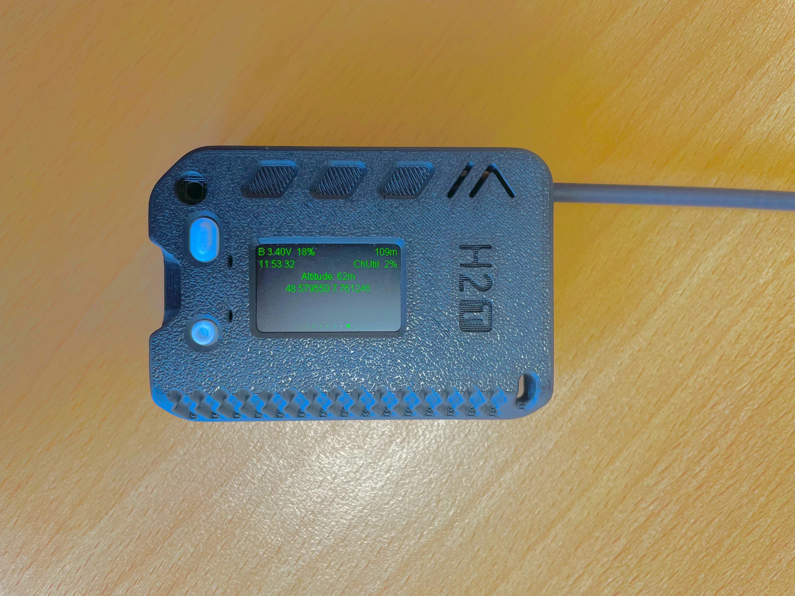
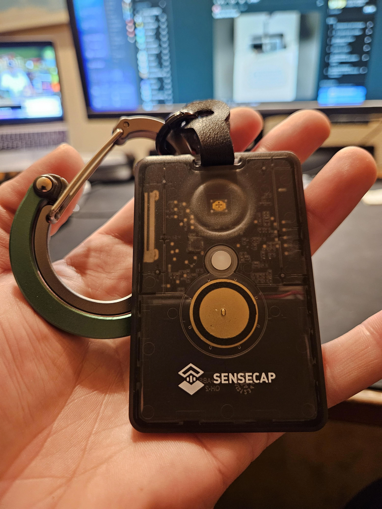
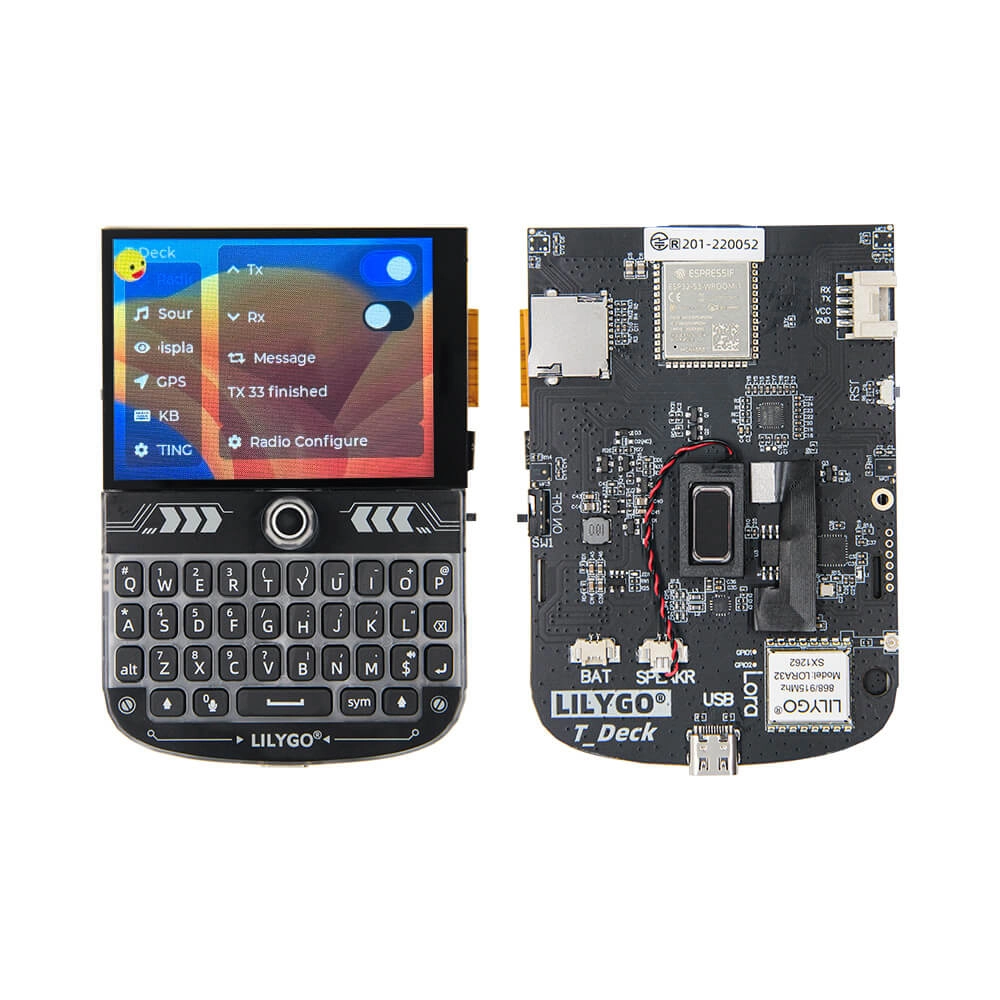

---
title: Le matériel
subtitle: Liste du matériel utilisé par la communauté Alsacienne
layout: ../layouts/StaticPage.astro
---

## Heltec T114
   
Le Mesh Node T114 est une carte de développement à faible consommation d'énergie basée sur les puces nRF52840 et SX1262, prenant en charge LoRa et Bluetooth 5.0. 
Elle intègre diverses interfaces d'alimentation (USB 5V, batterie lithium et panneau solaire), un écran TFT de 1,14 pouces en option, ainsi qu’un module GPS en tant qu'accessoire. 

Elle offre de puissantes capacités de communication longue distance, une grande extensibilité, et une conception à faible consommation. Grâce à l'environnement de développement et aux bibliothèques Heltec nRF52, vous pouvez l’utiliser pour des projets de développement LoRa/LoRaWAN, ainsi que pour faire fonctionner certains projets open source tels que Meshtastic.

### Liens

- [Lien pour la carte de développement sur AliExpress (Attention: selectionnez la bonne fréquence / avec ou sans GNSS / avec ou sans boitier)](https://fr.aliexpress.com/item/1005007556646669.html)
- [Antenne Gizont sur AliExpress (Sélectionnez la bonne fréquence)](https://fr.aliexpress.com/item/1005004607615001.html)
- [Boitiers 3D imprimables](https://www.yeggi.com/q/heltec+t114/)

## T1000

Format de carte qui se glisse facilement en poche. Equipé d'un capteur de température."

### Liens

- [Acheter sur AliExpress](https://www.aliexpress.us/item/1005007474293141.html)

## Lilygo T-Deck
    
Solution avec un clavier integré et avec l'interface Meshtastic UI

### Liens

- [Boutique site officiel](https://lilygo.cc/products/t-deck)
- [Boitier 3D](https://www.printables.com/model/1285162-zoidberg-lilygo-t-deck-tkeyboard-meshtastic-powere)

