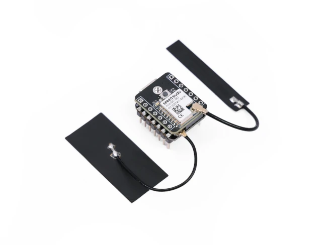
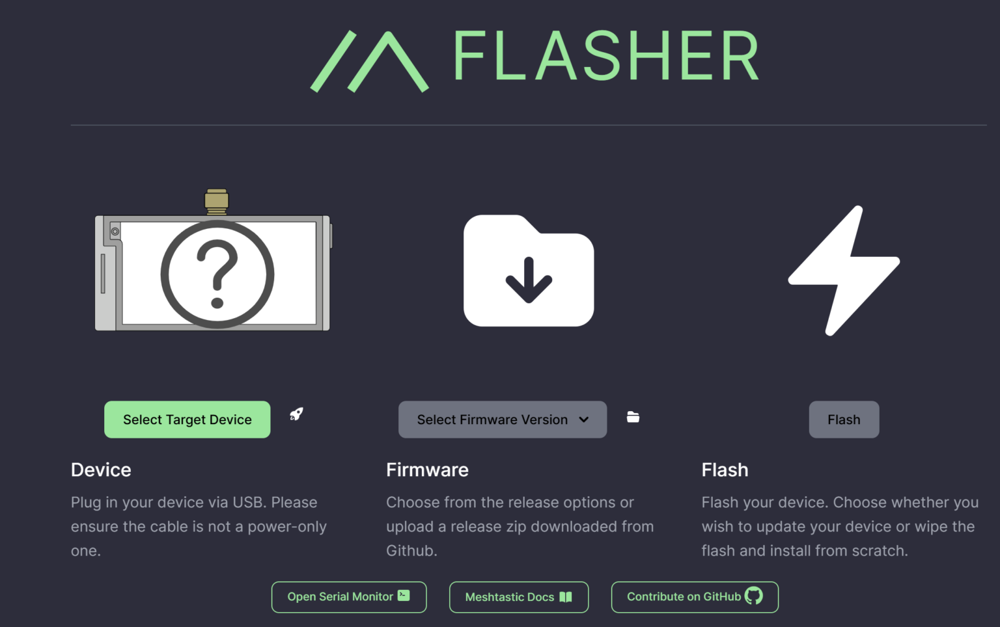

---
title: Nous rejoindre
subtitle: Vous trouverez ici tout ce dont vous avez besoin pour rejoindre le Mesh Alsacien 🥨
layout: ../layouts/StaticPage.astro
---

## Achat

La solution la moins couteuse et la plus accessible selon nous pour découvrir Meshtastic, c'est l'achat d'une carte de développement ESP32-S3 avec son module LoRa chez Seeed Studio.
Celle-ci possède tout le nécessaire pour se lancer:
- Un module LoRa SX1262 avec une petite antenne externe
- Un module Bluetooth
- Un module Wifi 2.4Ghz avec une petite antenne externe
- Un prix tout doux: ~10€ chez Aliexpress

Sinon, allez faire un tour sur la page [Matériel](/equipment) pour y découvrir une liste plus détaillée du matériel utilisé par les gens du Mesh Alsacien

---

## Flasher son materiel

Une fois la carte reçue, voici les étapes qu'on recommande.

<em>⚠️ Ne jamais allumer son matériel sans antenne connectée!</em>

-> Connectez simplement un cable usb à votre ordinateur, ouvrez un navigateur Chrome

Flashez le dernier firmware via [https://flasher.meshtastic.org](https://flasher.meshtastic.org/)

Vous pouvez choisir la dernière version stable 2.6 ou la version alpha 2.7.x (note: pour les appareils qui ont un écran, la version alpha est un vrai plus pour son nouveau style d'UI) 

## Installer l'application

Rendez vous sur votre store preferé pour télécharger l'appli Meshtastic ([Android](https://meshtastic.org/docs/software/android/installation/) via F-droid ou le PlayStore, et iOS via l'[AppleStore](https://meshtastic.org/docs/software/apple/installation/)).

Dans l'onglet Bluetooth, trouvez votre device, et connectez vous avec le PIN : **123456** si l'appareil ne possède pas d'écran pour vous indiquer le PIN. 

## Configurer le matériel

Dans l'application, configurez ainsi:

- Region LoRa : Europan Union 868MHz

  

    📌
    Vous voilà connecté·e au Mesh Alsacien
  

